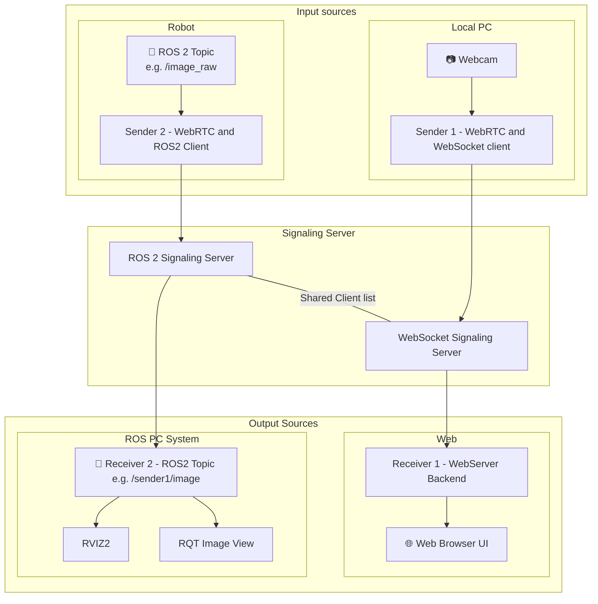

# webrtc-bridge
ROS 2 camera streaming

## Overview
This is an example implementation of a ROS 2 camera streaming node using 
- [OpenCV 2](https://opencv.org/) to get image data as stream or from a webcam of a browser or rosnode
- Provide the data using [aiortc](https://github.com/aiortc/aiortc) as WebRTC video stream.
- The clients exchange their information either via WebSocket or ROS.
- Receive the data and forward it as [ROS](https://ros.org) node, or directly to the browser. 

## Installation
You can either run this locally in your [ROS 2](https://docs.ros.org/en/jazzy/Installation.html) environment or you can use [Docker CE](https://docs.docker.com/engine/install/).

This webrtc-bridge is build with multiple scenarios in mind, with different machines that can send and receive video streams. Because of this the actual dependencies and installations can vary from machine to machine. Each example in the documentation has a section about the required installation steps.

NOTE: If you use Docker you need a Linux system that uses Wayland (Fedora 25 or Ubuntu 22.04 or newer).

## Overview

## Usage Example
Here are some examples how you could use this bridge to send, receive and process image data

### Example #1: Direct WebRTC connection with ROS 2
You can use the image publication without ROS to get a video stream from a machine with a camera but without ROS installed to your browser via web(socket) server.

We use WebRTC to send and receive a video stream that gets forwarded to ROS 2 where its getting displayed in rqt-image-view.

This is a minimal setup where we just receive a video stream that we want to process on our machine.

Start with [Example 01: Simple Direct Communication](docs/01_simple_direct.md)

### Example #2: Forward image data to ROS and a Web-Server (e.g. to control a robot over the internet)
In this example we have ROS on the sender and receiver side and we run some image processing on both with ros. The images get feed from a camera via OpenCV and are directly published as ROS images, then a ROS node that subscribes to the images locally forwards them via WebRTC to another Machine that also runs a ROS 2 node for image processing.

It gets also forwarded to a Web Browser with a data and video streaming connection so the user can see the image and send control commands.
Because we are already in a complex ROS network the ROS nodes also exchange the Signaling information for WebRTC via ROS and WebSocket, so our Signaling server supports both.

This could be useful for a scenario where you want to use the camera to do obstacle avoidance and overlay information for your human driver, so we include [svelte-robot-control](svelte-robot-control) to provide a user interface that also sends control commands back to the robot.

Continue with [Example 02: Forward and process data](docs/02_forward_ros.md)

### Example #3: Use the bridge with different sender and receiver
In this example we use the bridge to connect multiple systems with a camera (we simulate multiple cameras by publishing Image streams from video via ROS), this could be useful if you have mutliple cameras your use can choose from.

We use the WebSocket as well as a ROS node to exchange Signaling information, as we want to distribute the images for multiple receiver and display/process them in multiple places.

Next is [Example 03: Multiple Receiver](docs/03_multiple_receiver.md)

