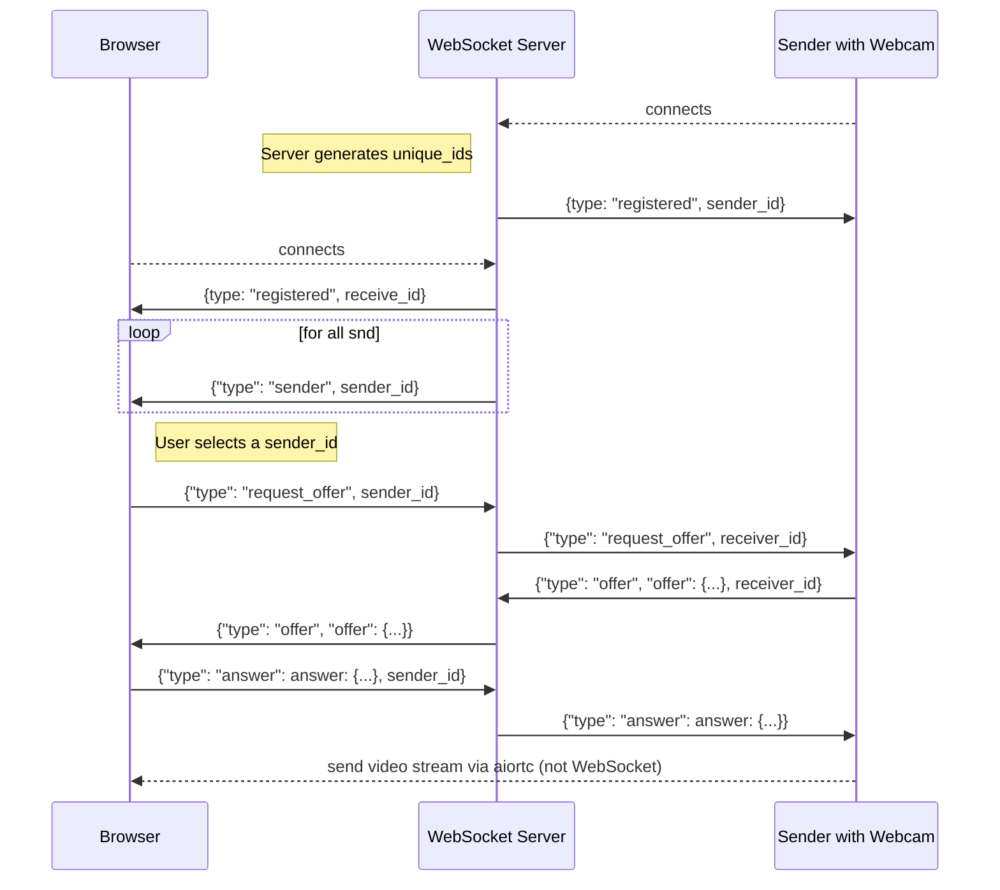
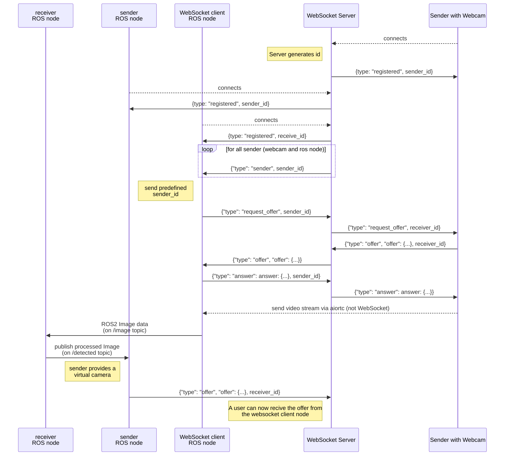

# webrtc-bridge
This is an example implementation of a ROS 2 camera streaming node using 
- [OpenCV 2](https://opencv.org/) to get image data as stream or from a webcam of a browser or rosnode
- Provide the data using [aiortc](https://github.com/aiortc/aiortc) as WebRTC video stream.
- The clients exchange their information either via WebSocket or ROS.
- Receive the data and forward it as [ROS](https://ros.org) node, or directly to the browser. 

## Communication Overview
Here are some examples how you could use this bridge to send, receive and process image data

### Example #1: Direct WebRTC connection (no ROS needed)
You use this system completely with WebSockets only using ROS to control the robot:

TODO: how to start

### Example #2: Forward image data to ROS for processing (e.g. obstacle detection)
The second example Sending and forwarding Image Data to a ROS node. The result of the image processing will be shown to a huma that connects with a browser:

TODO: how to start

### Example #3: Use the bridge to connect to a ROS 2 system with multiple cameras and forward to a User for manual control

Send compressed image data over a slow connection (e.g. WiFi) from a ROS-using robot with a camera to another ROS system running some image processing and a UI on a Browser, the robot uses local obstacle avoidance and also forwards the image streams for different users to control the robot.

TODO: sequence diagram

TODO: how to start

## Installation

Install docker (docker-ce).
run `docker compose build`

## Application
- WebRTC adjusts bitrate automatically depending on the network, ROS does not have such a feature, so the idea is to use WebRTC for images over a slower network and re-publishing on a local machine to use all the handy ROS and computer vision tools. This repo provides docker container to with a basic test setup.
- Sending ROS-images to a Browser is possible (e.g. compressing the images as websocket) but not a very elegant solution, however WebRTC as standard already exists, so it makes lots of sense to use it instead. See TODO: svelte-robot-control as example web application on controlling a robot using a [Virtual Joystick](https://github.com/brean/svelte-gamepad-virtual-joystick)

## Usage