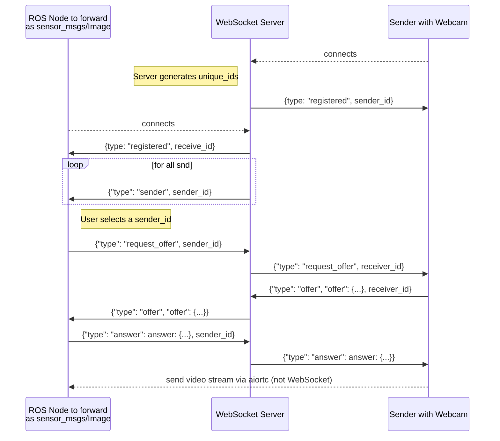

# Overview

This is a simple example with one dedicated machine that has a webcam but does not run ROS (for example a raspberry pi with Raspberry Pi OS or a notebook with a webcam), a server and a machine that runs ROS where you want to process the received images as ROS-Messages.

For more complex examples, that are maybe closer to your application look at the other examples.

# Installation
## Docker
Install docker-ce following [this](https://docs.docker.com/engine/install/) installation guide (don't forget the [post-install steps](https://docs.docker.com/engine/install/linux-postinstall/)), then 
just run `docker compose build` in the main folder.

You might also want to configure the `compose.yml` when your video device is not `/dev/video0`

## Individual installation
### Webcam-PC
For this example you need to install OpenCV and webrtc on the machine that sends the video stream you would install either just aiortc as webrtc-client with opencv and av to simply forward your camera images:
```bash
sudo apt-get install -y python3-aiortc python3-opencv python3-av
```

### WebRTC-Signaling Server
And on the server you need aiortc and fastapi
```bash
sudo apt-get install -y python3-aiortc python3-fastapi
```

### ROS-System PC
We also have a client for that receives the images from the server and forwards them to ROS so that needs at least aiortc, fastapi (as websocket-client) and the ROS 2 CV-bridge:
```bash
source /opt/ros/YOUR_ROS_ENV/setup.bash
sudo apt-get install -y python3-aiortc python3-fastapi ros-$ROS_DISTRO-cv-bridge
```

## Run
If you installed using docker start the `./run_example1-docker.bash` or `./run_example1-local.bash` otherwise. Both scripts start a terminator instance with the signaling server, rqt-image, the camera sending and receiving clients

## Sequence Diagram
