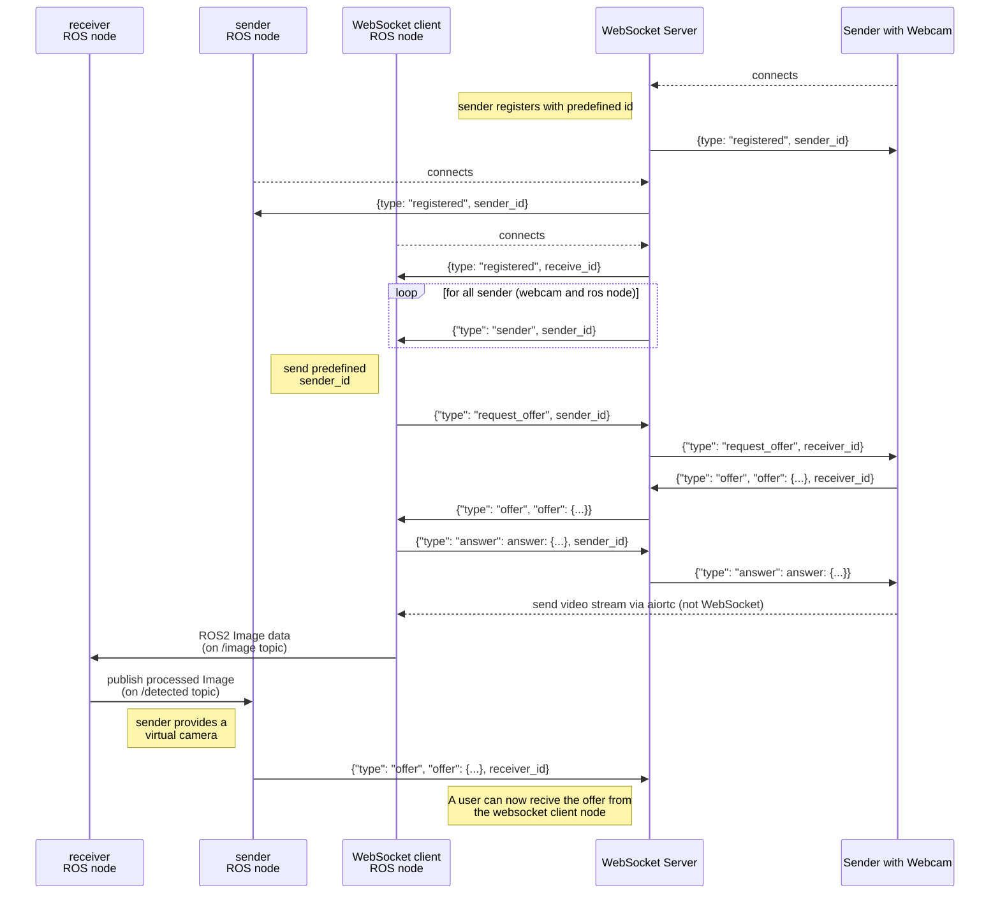

# Overview

```mermaid
sequenceDiagram
    participant r as receiver<br />ROS node
    participant s as sender<br />ROS node
    participant b as WebSocket client<br /> ROS node
    participant srv as WebSocket Server
    participant snd as Sender with Webcam
    snd-->>srv: connects
    Note left of srv: sender registers with predefined id
    srv->>snd: {type: "registered", sender_id}
    s-->>srv: connects
    srv->>s: {type: "registered", sender_id}
    b-->>srv: connects
    srv->>b: {type: "registered", receive_id}
    loop for all sender (webcam and ros node)
        srv->>b: {"type": "sender", sender_id}
    end
    Note left of b: send predefined<br />sender_id
    
    b->>srv: {"type": "request_offer", sender_id}
    srv->>snd: {"type": "request_offer", receiver_id}
    snd->>srv: {"type": "offer", "offer": {...}, receiver_id}
    srv->>b: {"type": "offer", "offer": {...}}
    b->>srv: {"type": "answer": answer: {...}, sender_id}
    srv->>snd: {"type": "answer": answer: {...}}
    snd-->>b: send video stream via aiortc (not WebSocket)
    b->>r: ROS2 Image data<br />(on /image topic)
    r->>s: publish processed Image<br />(on /detected topic)
    Note left of s: sender provides a<br>virtual camera
    s->>srv: {"type": "offer", "offer": {...}, receiver_id}
    Note left of srv: A user can now recive the offer from <br/>the websocket client node
```